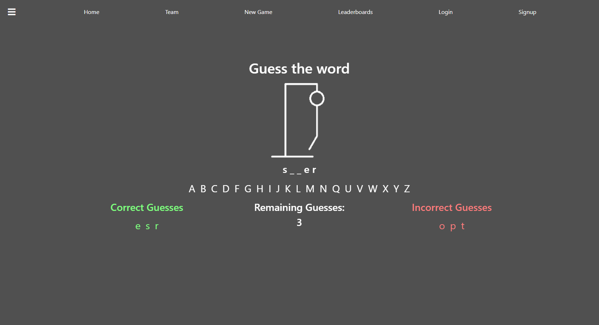

# hangman

## Description
This is a full-stack application designed to give a fun experience playing [Hangman](https://en.wikipedia.org/wiki/Hangman_(game)). Users can simply go to the game page to play. Users can also create an account and save their scores (wins/losses).

## Table of Contents
- [Usage](#usage)
- [Installation](#installation)
- [License](#license)
- [How To Contribute](#how-to-contribute)
- [Tests](#tests)
- [Questions](#questions)

## Usage
You can visit the website [here](https://the-hangman-app.herokuapp.com/)

## Installation
You can use the application through the link above or follow the instructions below to run the files locally.
- [Go here](https://github.com/MarkCirineo/hangman) then click the green **Code** button. Then download the ZIP or clone the repository
- Set up the environment variables in a .env file
- Run "npm i" in a terminal at the root directory level to install the dependencies (You need to have Node.js installed on your machine)
- Run "npm run develop" in the terminal to run the application
- Go to http://localhost:3000/ in your browser to use the application

## License
This project is licensed under the MIT License (2021)
## How to Contribute
If you want to contribute to the project you can contact me at markcirineo22@gmail.com
## Tests
N/A
## Questions
If you have any question you can view my GitHub Profile [here](https://www.github.com/MarkCirineo), or you can contact me here: markcirineo22@gmail.com